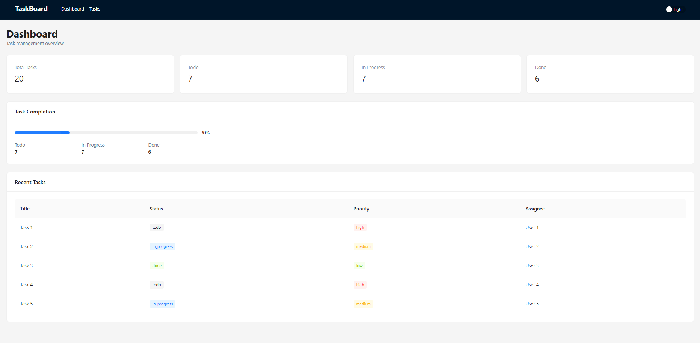
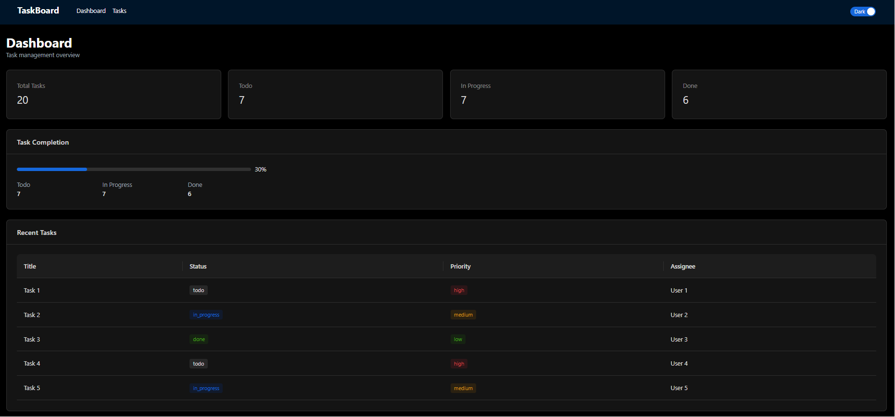
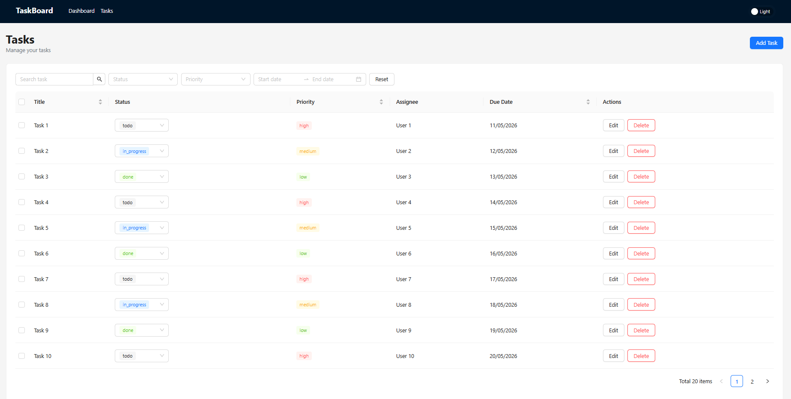
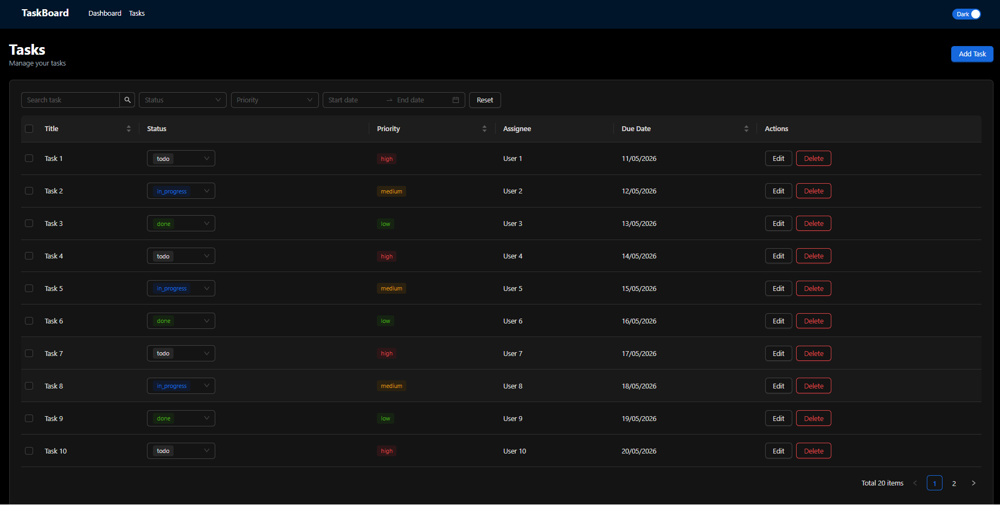
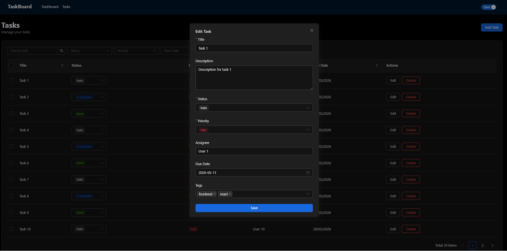
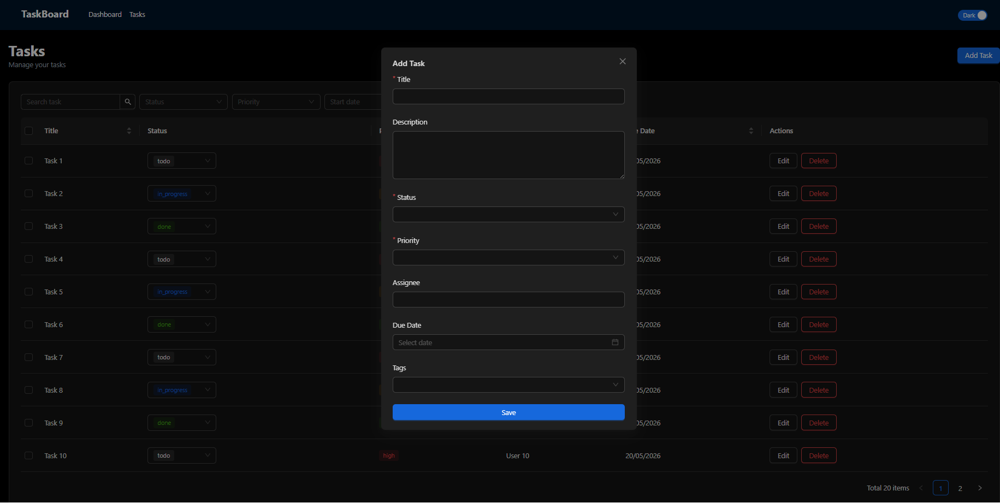

# TaskBoard

TaskBoard là ứng dụng quản lý công việc nội bộ được xây dựng bằng React + TypeScript theo yêu cầu bài test Frontend Developer.

## Tech Stack

- React 18
- TypeScript 5 (Strict Mode)
- Redux Toolkit 2
- React Redux
- React Router DOM
- Ant Design 5
- Tailwind CSS 3
- Vite
- Vitest
- Testing Library

---

# Features

## Dashboard

- Hiển thị thống kê task:
  - Total Tasks
  - Todo
  - In Progress
  - Done

- Progress completion
- Danh sách 5 task mới nhất
- Responsive layout

---

## Task Management

### CRUD Task

- Thêm task mới
- Chỉnh sửa task
- Xoá task
- Xoá nhiều task cùng lúc

### Task Table

- Pagination
- Sorting:
  - Title
  - Due Date
  - Priority

### Inline Update

- Đổi trạng thái task trực tiếp trong table

---

## Search & Filters

- Search theo title
- Filter theo status
- Filter theo priority
- Filter theo due date range
- Reset filters

Toàn bộ logic filter được xử lý bằng Redux selectors với `createSelector`.

---

## UI / UX

- Responsive layout
- Empty state
- Confirm delete modal
- Reusable components
- Dark mode toggle

---

## Bonus Features

- Unit test cho selector
- Unit test cho component
- Persist filters bằng URL query params
# TaskBoard

TaskBoard là ứng dụng quản lý công việc nội bộ được xây dựng bằng React + TypeScript theo yêu cầu bài test Frontend Developer.

---

## Tech Stack

- React 18
- TypeScript 5 (Strict Mode)
- Redux Toolkit 2
- React Redux
- React Router DOM
- Ant Design 5
- Tailwind CSS 3
- Vite
- Vitest
- React Testing Library

---

## Installation & Run

### Clone repository

```bash
git clone https://github.com/VanTan157/fe-test-Truong-Van-Tan.git
```

### Install dependencies

```bash
npm install
```

### Run development server

```bash
npm run dev
```

Ứng dụng sẽ chạy tại:

```txt
http://localhost:5173
```

### Build production

```bash
npm run build
```

### Run tests

```bash
npm run test
```

---

## Features

### Dashboard

- Hiển thị thống kê task:
  - Total Tasks
  - Todo
  - In Progress
  - Done

- Progress completion theo trạng thái task
- Danh sách 5 task được tạo gần nhất
- Responsive layout

---

### Task Management

#### CRUD Task

- Thêm task mới
- Chỉnh sửa task
- Xoá task
- Xoá nhiều task cùng lúc

#### Task Table

- Pagination
- Sorting:
  - Title
  - Due Date
  - Priority

#### Inline Update

- Đổi trạng thái task trực tiếp trong table

---

### Search & Filters

- Search theo title
- Filter theo status
- Filter theo priority
- Filter theo due date range
- Reset filters

Toàn bộ logic filter được xử lý bằng Redux selectors với `createSelector`.

---

### UI / UX

- Responsive layout
- Loading state
- Empty state
- Confirm delete modal
- Reusable components
- Dark mode toggle

---

### Bonus Features

- Unit test cho selector
- Unit test cho component
- Persist filters bằng URL query params

---

## Redux Architecture

Ứng dụng sử dụng Redux Toolkit với:

- `createSlice`
- `createSelector`
- Memoized selectors
- Typed hooks

Các selectors chính:

- `selectAllTasks`
- `selectFilteredTasks`
- `selectPaginatedTasks`
- `selectTaskStats`

---

## Testing

Ứng dụng sử dụng:

- Vitest
- React Testing Library

Đã viết test cho:

- Redux selector
- Reusable component

---

## Screenshots / Demo

### Dashboard




### Task List






